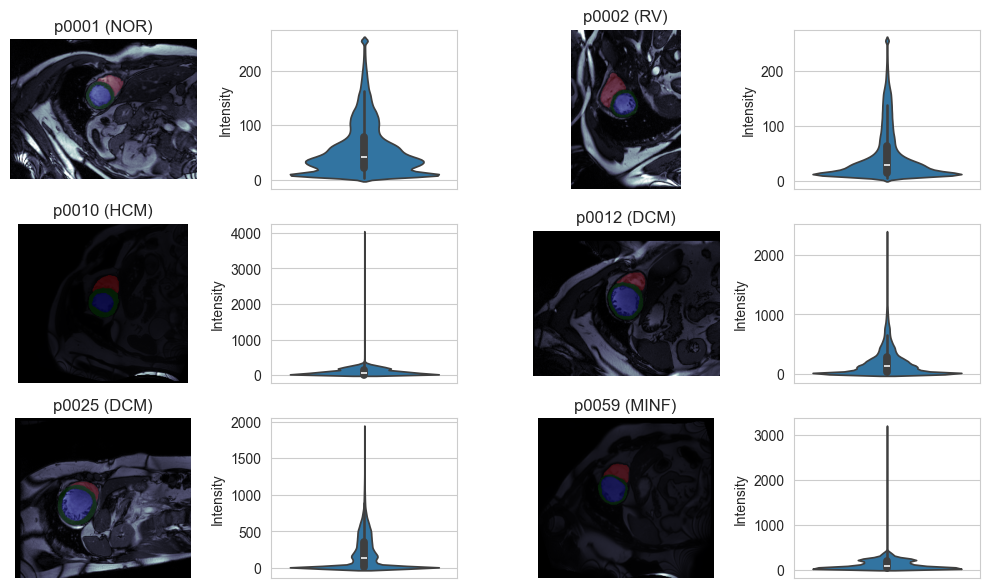
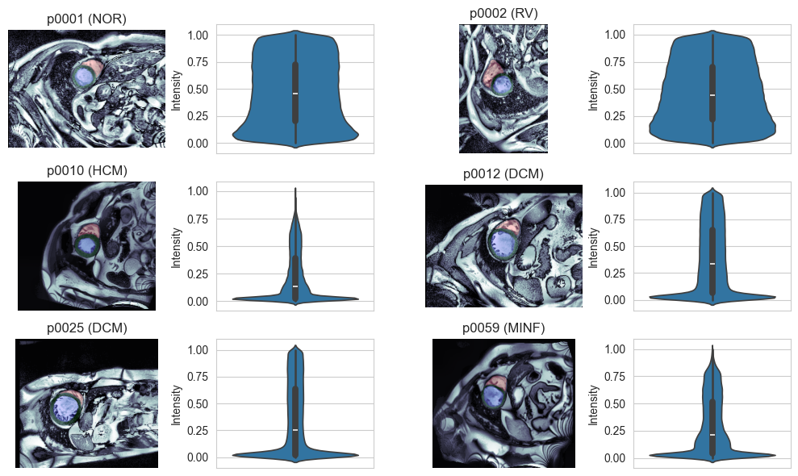
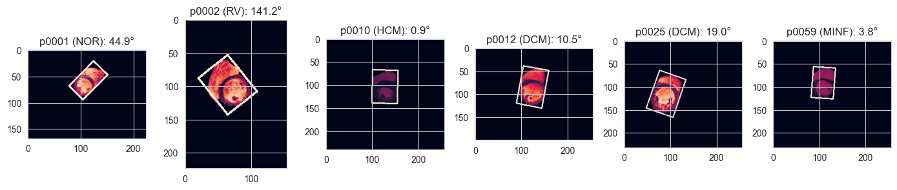

# Dataset Characteristics

**[Notebook](exploratory_data_analysis.ipynb)**

## Background
The dataset is derived from the Automated Cardiac Diagnosis Challenge (ACDC) and includes 
3D MRI data from 150 patients, split into 100 training and 50 evaluation datasets. 
For each patient, two temporal frames are provided (end-systole and end-diastole). 
Additionally, segmentation masks for three key anatomical regions are included:  
The right ventricle (RV), the left ventricle (LV), and the myocardium (MC).

## Objective
The objective is to classify each patient into one of five disease classes:
1.	Healthy / Normal (NOR)
2.	Myocardial infarction (MINF)
3.	Dilated cardiomyopathy (DCM)
4.	Hypertrophic cardiomyopathy (HCM)
5.	Abnormal right ventricle (RV)

Each of the 5 classes was equally distributed in the training set.

## Preprocessing
Different preprocessing procedures and analysis of MRI data and segmentation masks were performed 
to ensure consistency and usability across recordings.

### Intensity normalization
The original MRI data had outliers in their intensity values (properly artefacts), 
as can be seen in the image below. Thus intensities were cropped at .5 and 99.5 Percentile values.
Additionally, (adaptive) histogram normalization was performed. 

*Fig. 1. Before normalization*

*Fig. 2. After normalization*

### Orientation / Rotation normalization
Some of the images were wrongly oriented (and had erroneous spatial affines). This was corrected by 
detecting the long axis of the heart and normalizing its rotation

*Fig. 3. Rotation approximation*