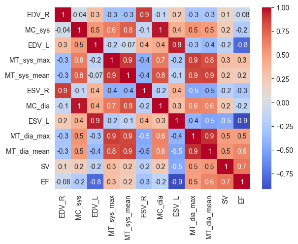
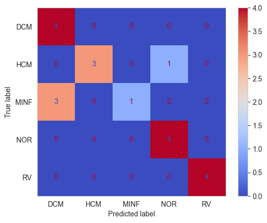

# Baseline Model

**[Notebook](baseline_model.ipynb)**

A classical feature based approach serves as a baseline model. Anatomical and physiological features 
typically employed in this domain, e.g. ventricle volumes and myocardium thickness.

## Feature engineering
Using the segmentation masks the volumes of all three structures in the end-systolic and end-diastolic phases
and the mean and maximum myocardium thickness are calculated. Using the left ventricle volume the 
(left) stroke volume and ejaction fraction are calculated.
List of features:
* ESV: end-systolic volume (left and right)
* EDV: end-diastolic volume (left and right)
* MV: myocardium volume (systolic & diastolic)
* MT: myocardium thickness (mean & max)
* SV: (left) stroke volume, using the formula $SV=EDV-ESV$
* EF: (left) ejaction fraction, using the formula $EF=SV/EDV$

***Tab. 1.*** *Per-class mean values of (most of) the engineered features*

|      | EDV_R | EDV_L | ESV_R | ESV_L | MT_sys | MT_dia | SV   | EF   |
|------|-------|-------|-------|-------|--------|--------|------|------|
| DCM  | 186.1 | 275.6 | 128.6 | 224.9 | 11.0   | 13.2   | 50.7 | 19.1 |
| HCM  | 121.2 | 127.9 | 47.7  | 42.0  | 19.8   | 24.4   | 86.0 | 67.2 |
| MINF | 126.2 | 189.3 | 58.3  | 131.8 | 12.2   | 16.8   | 57.5 | 30.6 |
| NOR  | 147.7 | 130.8 | 69.2  | 51.0  | 10.1   | 15.3   | 79.9 | 61.1 |
| RV   | 220.6 | 125.5 | 139.6 | 54.0  | 9.7    | 14.0   | 71.5 | 57.5 |

*Fig. 1. Correlation matrix of the calculated features. As expected some of the features are strongly correlated*

## Modeling
Since the true test set is not public, a train-test split (80-20) was first used for evaluation.
Using scikit-learn a model pipeline is implemented to test different models and hyperparameters using
a GridSearch cross-validation. Since the features are on different scales and collinear, different preprocessing
(passthrough, MinMaxScaling, StandardScaler) and dimensionality reduction (passthrough, PCA(3), PCA(5)) are tested
as well.

The following models are tested with a grid of typical hyperparameters:
* LogisticRegression
* SVM
* DecisionTree
* RandomForest
* GradientBoosting
* MLPClassifier

## Results
The best performing model was a SVM with the following parameters:
* No PCA
* MinMaxScaling
* C = 10
* Kernel = linear

It resulted in a cross-validation F1-score 0.924 and a score 0.77 on the evaluation split

               Precision    Recall  F1-score   Support

         DCM       0.57      1.00      0.73         4
         HCM       1.00      0.75      0.86         4
        MINF       1.00      0.25      0.40         4
         NOR       0.80      1.00      0.89         4
          RV       1.00      1.00      1.00         4

    accuracy                           0.80        20
    macro avg      0.87      0.80      0.77        20
    weighted avg   0.87      0.80      0.77        20

*Fig. 2. Confusion matrix plot on the 20% evaluation split*