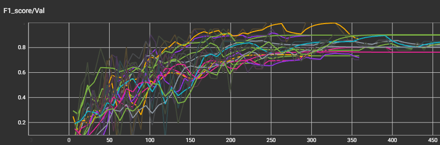

# Model Definition and Evaluation

**[Notebook](monai_resnet.ipynb)**

## Overview:

Employing PyTorch lightning and Monai, a deep learning approach was implemented, 
leveraging the 3D spatial structure of cardiac MRI to improve classification performance.
Based on the exploratory analysis, different preprocessing steps were performed to ensure 
consistency and usability across recordings. The resulting model's performance was assessed 
using the weighted F1-Score, ensuring robust and balanced predictions across all disease categories.

## Model choice
For a multi-class classification task in image domain, a CNN trained with CrossEntropy is a 
common choice. The best known architecture is ResNet a deep CNN with residual connection 
(aka skip connections). Since the MRI data is 3D imagery, a 3D-ResNet would be the equivalent. 
Monai has ready implementations for 3D-ResNet of different sizes. A ResNet18 is chosen as a 
comparable small one, since with 100 MRIs the dataset is comparatively small.

## Preprocessing
Monai already implements a lot of the transformations needed for preprocessing. 
Three custom ones are implemented for the more specialised processing (MultiMaskIntensity, AdaptiveHistogramNormalize, EllipseFitRotate).
To test the optimal preprocessing the custom DataModule implementation is configurable by a lot of parameter settings.

## Model training
* Stratified 80/20 train-val-split
* AdamW Optimizer with weight decay
* Batch Size between 10-20
* Further hyperparameter tuning with *optuna*

--> F1-Score: ~0.8 