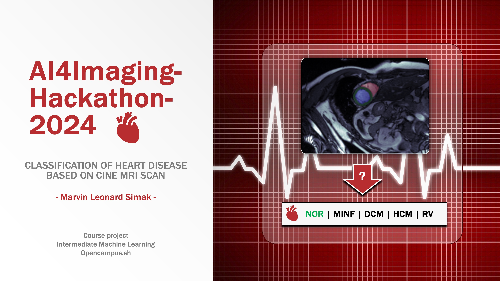

# Cardiopathy Classification Project

[GitHub](https://github.com/kamisoel/cardiopathy-classification) | 
[AI4imaging Kaggle Challenge](https://www.kaggle.com/competitions/ai4imaging-hackathon-2024/)

The goal of the challenge is to build a deep learning or radiomics model to classify
heart diseases based on Cine Heart Magnetic Resonance Images (MRI).

## Dataset

The provided dataset is a shuffled version of the Automated Cardiac Diagnosis Challenge (ACDC).
It contains 3D cardiac MRI data of 150 subjects (100 training + 50 testing).
For each subject two frames (end-systolic and end-diastolic) are given. 
Additionally, segmentation masks for the right ventricle (RV), left ventricle (LV)
and myocardium (MC) are provided.  
The aim is to automatically categorize each subject into one of five classes:
- Normal (NOR)
- Myocardial infarction (MINF)
- Dilated cardiomyopathy (DCM)
- Hypertrophic cardiomyopathy (HCM)
- Abnormal right ventricle (RV)

For evaluation Mean F1-Score is used, which maximize both precision and recall simultaneously.

### Results Summary

- **Best Model:** RBF-SVM based on calculated features (volumes, thickness, ejaction fraction, etc.)
- **F1-score:** *0.98*

- **DL Model:** ResNet18 (using Monai & PyTorch Ligthning)
- **F1-score:** 0.8

## Documentation

1. **[Literature Review](0_LiteratureReview/README.md)**
2. **[Dataset Characteristics](1_DatasetCharacteristics/exploratory_data_analysis.ipynb)**
3. **[Baseline Model](2_BaselineModel/baseline_model.ipynb)**
4. **[Model Definition and Evaluation](3_Model/model_definition_evaluation)**
5. **[Presentation](4_Presentation/README.md)**

## Cover Image

